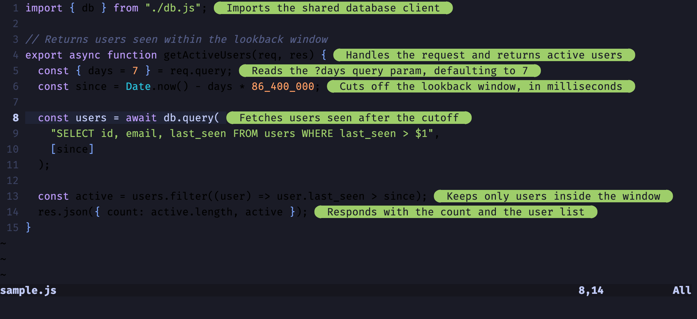

# consolelog.nvim

**See your console output right where it belongs - next to your code!**

A Neovim plugin that captures and displays console outputs as virtual text inline with your code. Features automatic framework detection, intelligent project setup, and comprehensive debugging capabilities for modern JavaScript development.

## Demo


## Key Features

- Real-time Console Capture - See console outputs instantly as virtual text next to your code
- Browser Support - Automatic console capture for Next.js, React, Vue, and Vite projects
- Single-File Runner - Run standalone `.js`, `.mjs`, `.cjs`, `.ts`, `.mts`, `.cts`, and `.py` files with console capture via Node.js Inspector (JS/TS) or a zero-dependency Python bootstrap (Python 3.8+)
- Smart Object Display - Inline previews for small objects, floating inspector for large ones
- Zero Config - Works out of the box with intelligent project detection
- Accurate Line Mapping - Outputs appear exactly where they're logged using source maps
- Framework Support - Works with all JavaScript frameworks providing source maps (Next.js, React, Vue, Vite, and more)
- Yankable Output - Copy console outputs directly from the inspector
- Inline History - Navigate through multiple console outputs on the same line
- Multiple Sessions - Run multiple projects simultaneously with automatic port management
- Auto-Reconnection - Robust connection handling with exponential backoff
- Syntax Highlighting - Color-coded output by console type (log, error, warn, info, debug)
- LLM Code Explanations - Explain a selection or the whole buffer line-by-line in plain English, rendered as virtual text (`<leader>le`)

## Star This Project

If ConsoleLog.nvim helps you debug faster and code more efficiently, please consider giving it a star! It helps others discover the plugin and motivates continued development.

## Installation

### lazy.nvim

```lua
{
    "chriswritescode-dev/consolelog.nvim",
    config = function()
      require("consolelog").setup()
    end,
}
```


## Usage

ConsoleLog automatically detects your project type and enables console capture:

1. Enable ConsoleLog: `:ConsoleLogToggle` or `<leader>lt`
2. Write code with console.log() in any JavaScript/TypeScript file
3. See output instantly as virtual text next to your code

### Project-Specific Behavior

**Single-File Execution** (`:ConsoleLogRun` or `<leader>lr`):
- **JavaScript/TypeScript**: `.js`, `.mjs`, `.cjs`, `.ts`, `.mts`, `.cts` files
  - TypeScript requires Node >= 22.6 (native from 23.6; `--experimental-strip-types` added automatically for 22.6–23.5). Node type stripping supports only erasable TypeScript syntax and does not apply `tsconfig` transforms.
  - Runs via Node.js Inspector with console capture; values are rendered by `util.inspect` inside the process, so `Map`, `Set`, iterators and nested structures are captured at log time (Node >= 22.3)
- **Python**: `.py` files — zero-dependency stdlib bootstrap, Python 3.8+
  - Captures `print()`, `logging` records, raw `sys.stderr` writes, and uncaught exceptions
  - Interpreter resolution: `runner.python_executable` config → `$VIRTUAL_ENV` → `.venv`/`venv` walking up from file → `python3`
- Auto re-runs on save for buffers previously run with `:ConsoleLogRun` (configurable via `runner.rerun_on_save`)
- Perfect for quick scripts and standalone JavaScript/TypeScript/Python files

**Browser Framework Projects** (automatic):
- Supports: `.js`, `.jsx`, `.ts`, `.tsx`
- Works with: Next.js, React, Vue, Vite, and any framework with source maps
- Automatically injects WebSocket console capture
- Just run `npm run dev` and start coding

**Python** (single-file execution):
- `print()` calls are captured with source location (file + line number)
- `logging` records at WARNING+ are captured by default; lower levels are captured if the script configures its own logging level or calls `logging.basicConfig(level=...)`
- Raw `sys.stderr` writes are buffered per-line and emitted as error events
- Uncaught exceptions (including `SyntaxError` and non-zero `SystemExit`) report the deepest relevant traceback frame
- Interpreter resolution order: `runner.python_executable` config key → `$VIRTUAL_ENV/bin/python` → `.venv/bin/python` or `venv/bin/python` walking up from the script's directory → system `python3`
- Zero external dependencies — the bootstrap is a single stdlib-only Python 3.8+ script (`py/consolelog_runner.py`)

## Commands & Keybindings

### Core Commands

| Key | Command | Description |
|-----|---------|-------------|
| `<leader>lt` | `:ConsoleLogToggle` | Toggle ConsoleLog on/off |
| `<leader>lr` | `:ConsoleLogRun` | Run current file with ConsoleLog |
| `<leader>lx` | `:ConsoleLogClear` | Clear all console outputs |
| `<leader>ls` | `:ConsoleLogStatus` | Show status and diagnostics |

### Inspect Commands

| Key | Command | Description |
|-----|---------|-------------|
| `<leader>li`  | `:ConsoleLogInspect` | Inspect output at cursor line |
| `<leader>la`  | `:ConsoleLogInspectAll` | Show all outputs (all buffers) |
| `<leader>lb`  | `:ConsoleLogInspectBuffer` | Show all outputs (current buffer) |

**Inspector Navigation:**
- Press `<Enter>` on any output line to jump to its source location
- Press `q` or `<Esc>` to close the inspector window

### Explain Commands

| Key | Command | Description |
|-----|---------|-------------|
| `<leader>le` | `:ConsoleLogExplain` | Explain code in English inline (selection in visual mode, whole buffer in normal mode) |
| `<leader>lE` | `:ConsoleLogExplainClear` | Clear inline code explanations |
| `<leader>lv` | `:ConsoleLogExplainToggle` | Hide/show cached explanations to see the code unobstructed |
| `<leader>lI` | `:ConsoleLogExplainInspect` | Open the full explanation for the current line in a float (like the diagnostics float) |

### Debug Commands

| Key | Command | Description |
|-----|---------|-------------|
| `<leader>ld` | `:ConsoleLogDebugToggle` | Toggle debug logging on/off |
| `<leader>lg` | `:ConsoleLogDebug` | Open debug log |
| `<leader>lG` | `:ConsoleLogDebugClear` | Clear debug log |

### Maintenance

| Key | Command | Description |
|-----|---------|-------------|
| `<leader>lR` | `:ConsoleLogReload` | Reload plugin |

## Configuration

The plugin works out of the box with sensible defaults. Here's the full configuration:
```lua
{
  "chriswritescode-dev/consolelog.nvim",
  config = function()
    require("consolelog").setup({
      auto_enable = true,        -- Auto-enable on startup
      log_level = "silent",      -- "debug", "info", "warn", "error", "silent"
      display = {
        virtual_text = true,     -- Show output as virtual text
        virtual_text_pos = "eol", -- Position: "eol" or "inline"
        prefix = " ▸ ",          -- Prefix before output
        throttle_ms = 50,        -- Throttle updates in milliseconds
        max_width = 0,           -- Maximum width of inline output (0 = no limit)
      },
      websocket = {
        ping_interval = 15000,   -- WebSocket ping interval (ms)
        close_timeout = 30000,   -- WebSocket close timeout (ms)
        display_methods = { "log", "error" }, -- Console methods to display inline
        reconnect = {
          enabled = true,        -- Auto-reconnect on disconnect
          max_attempts = 5,      -- Max reconnection attempts
          delay = 1000,          -- Delay between attempts (ms)
        },
      },
      inspector = {
        auto_resume = true,      -- Auto-resume inspector on new output
        capture_exceptions = true, -- Capture uncaught exceptions
        console_methods = { "log", "error", "warn", "info", "debug" }, -- Methods to capture
      },
      runner = {
        rerun_on_save = true,    -- Re-run single-file buffers on save after :ConsoleLogRun
        python_executable = nil, -- Override Python interpreter (nil = auto-detect)
      },
      explain = {
        provider = "openai",     -- LLM provider: "openai" or "anthropic"
        model = "gpt-4o-mini",   -- Model used for explanations
        url = nil,               -- Override API endpoint (e.g. local Ollama)
        api_key_env = nil,       -- Env var with the API key (nil = provider default, false = no key)
        temperature = nil,       -- Sampling temperature; nil defers to the server/model default, set a number to override
        max_tokens = 32768,      -- Maximum tokens per response (headroom for reasoning models)
        timeout_ms = 120000,     -- Request timeout in milliseconds
        extra_body = nil,        -- Extra fields merged into the request body, e.g. { chat_template_kwargs = { thinking = false } } for vLLM
        max_lines = 50,          -- Lines per request; longer ranges are split into sequential chunks
        max_context_lines = 1000, -- Whole file rides along as context up to this many lines; larger files send only the lines above the chunk
        prefix = "",              -- Prefix before each explanation
        max_width = 80,          -- Wrap explanations wider than this into virtual lines below the code
      },
      keymaps = {
        enabled = true,          -- Enable default keymaps
        toggle = "<leader>lt",   -- Toggle ConsoleLog
        run = "<leader>lr",      -- Run current file
        clear = "<leader>lx",    -- Clear outputs
        inspect = "<leader>li",  -- Inspect at cursor
        inspect_all = "<leader>la", -- Inspect all
        inspect_buffer = "<leader>lb", -- Inspect buffer
        reload = "<leader>lR",   -- Reload plugin
        debug_toggle = "<leader>ld", -- Toggle debug logging
        explain = "<leader>le",  -- Explain code inline (whole buffer)
        explain_clear = "<leader>lE", -- Clear inline code explanations
        explain_toggle = "<leader>lv", -- Toggle explanation visibility
        explain_inspect = "<leader>lI", -- Show the full explanation for the current line in a float
      },
    })
  end,
  keys = {
    { "<leader>lt", "<cmd>ConsoleLogToggle<cr>",       desc = "Toggle ConsoleLog" },
    { "<leader>lr", "<cmd>ConsoleLogRun<cr>",          desc = "Run file with ConsoleLog" },
    { "<leader>lx", "<cmd>ConsoleLogClear<cr>",        desc = "Clear console outputs" },
    { "<leader>li", "<cmd>ConsoleLogInspect<cr>",      desc = "Inspect output at cursor" },
    { "<leader>la", "<cmd>ConsoleLogInspectAll<cr>",   desc = "Inspect all outputs" },
    { "<leader>lb", "<cmd>ConsoleLogInspectBuffer<cr>", desc = "Inspect buffer outputs" },
    { "<leader>ld", "<cmd>ConsoleLogDebugToggle<cr>",  desc = "Toggle debug logging" },
    { "<leader>ls", "<cmd>ConsoleLogStatus<cr>",       desc = "Show status" },
    { "<leader>lR", "<cmd>ConsoleLogReload<cr>",       desc = "Reload plugin" },
    { "<leader>lg", "<cmd>ConsoleLogDebug<cr>",        desc = "Open debug log" },
    { "<leader>lG", "<cmd>ConsoleLogDebugClear<cr>",   desc = "Clear debug log" },
    { "<leader>le", "<cmd>ConsoleLogExplain<cr>",      desc = "Explain code inline (selection or whole buffer)" },
    { "<leader>lE", "<cmd>ConsoleLogExplainClear<cr>", desc = "Clear inline code explanations" },
    { "<leader>lv", "<cmd>ConsoleLogExplainToggle<cr>", desc = "Toggle explanation visibility" },
    { "<leader>lI", "<cmd>ConsoleLogExplainInspect<cr>", desc = "Show full explanation for current line" },
  },
  cmd = {
    "ConsoleLogToggle",
    "ConsoleLogClear",
    "ConsoleLogRun",
    "ConsoleLogInspect",
    "ConsoleLogInspectAll",
    "ConsoleLogInspectBuffer",
    "ConsoleLogDebugToggle",
    "ConsoleLogStatus",
    "ConsoleLogReload",
    "ConsoleLogDebug",
    "ConsoleLogDebugClear",
    "ConsoleLogExplain",
    "ConsoleLogExplainClear",
    "ConsoleLogExplainToggle",
    "ConsoleLogExplainInspect",
  },
  ft = { "javascript", "typescript", "javascriptreact", "typescriptreact", "python" },
}
```


## Code Explanations



`:ConsoleLogExplain` sends the selected lines (or the whole buffer) to an LLM and renders a short, behavior-focused explanation of each line (at most 12 words) as virtual text. The API key is read from an environment variable — `OPENAI_API_KEY` for OpenAI, `ANTHROPIC_API_KEY` for Anthropic — and `curl` must be installed. Explanations work in any regular buffer, unlike runtime console capture which is JavaScript/TypeScript/Python only.

**Local / self-hosted models:** point the `openai` provider at any OpenAI-compatible endpoint — for example [Ollama](https://ollama.com):
```lua
explain = {
  provider = "openai",
  url = "http://localhost:11434/v1/chat/completions",
  api_key_env = false, -- no API key required
  model = "qwen2.5-coder",
},
```

**Lifecycle:**
- Explanations longer than `max_width` (default 80) wrap into virtual lines below the code line — the code is pushed down, never covered.
- `:ConsoleLogExplainToggle` (`<leader>lv`) hides and shows all of a buffer's explanations instantly, without losing the cache or re-hitting the LLM.
- `:ConsoleLogExplainInspect` (`<leader>lI`) opens the current line's full explanation in a cursor-anchored float — useful when a long explanation is clipped at the screen edge. `q` or `<Esc>` closes it.
- Explanations are cached: they follow your edits, survive saves and reloads, and are replaced only by re-running `:ConsoleLogExplain` on the section/buffer or removed by `:ConsoleLogExplainClear`.
- If you keep editing without re-explaining, annotations can drift from the code's meaning; a reload of externally-changed content re-renders them at their last-saved lines.
- While a request is in flight an animated spinner toast shows progress (`⠹ Explaining lines 101-200 (2/5)`) and resolves into the result message; in-place updates need a `vim.notify` UI such as snacks.nvim, nvim-notify, or noice.
- There is no cap on the range: ranges longer than `max_lines` (default 50) are split into separate sequential requests — the first chunk starts exactly at the cursor line, continues to the end of the range, then wraps to cover the top, and annotations render progressively as each chunk completes.
- Explanations work in any regular buffer regardless of filetype; if you lazy-load the plugin, make sure the explain commands/keys are in your `cmd`/`keys` triggers.
- A response arriving after the buffer changed mid-request is discarded with a warning; remaining chunks are aborted.
- `max_tokens` (default 32768) leaves headroom for reasoning models that spend tokens thinking before answering; a truncated response reports "stopped at max_tokens" instead of failing silently. `temperature` is only sent when explicitly set to a number — by default the server/model generation defaults apply.
- Each request sends the file as numbered context (with an instruction bounding the lines to explain) so explanations understand imports and enclosing scopes. When the file is longer than `max_context_lines` (default 1000), only a window of that many lines ending at the chunk's last line is sent instead. When the whole file fits, every request carries the identical file prefix, which plays well with server-side prefix caching (e.g. vLLM).
- A chunk with nothing worth explaining (all comments or docstrings) is a valid empty answer, not an error — this also keeps reasoning models from spiraling on doc-heavy chunks.
- `extra_body` merges arbitrary fields into the request body for server-specific options, e.g. `{ chat_template_kwargs = { thinking = false } }` to disable the thinking channel on vLLM.

## Why ConsoleLog.nvim?

After using Console Ninja in VSCode, I couldn't find anything similar for Neovim. ConsoleLog.nvim brings that same inline console output experience to Neovim, eliminating context switching between your editor and terminal/browser console.

So it's something I created to make my life easier, and I thought it might be useful to others.


## Contributing

Pull requests are welcome! Especially for:
- Framework compatibility issues
- New framework integrations
- Source map improvements
- Bug fixes and enhancements

If you encounter issues with a specific JavaScript framework, please open an issue with details about your project setup.

## Acknowledgments

Inline output styling inspired by [tiny-inline-diagnostic.nvim](https://github.com/rachartier/tiny-inline-diagnostic.nvim) - a beautiful plugin for inline diagnostics display. 
## Architecture

- **Modular design**: Separate modules for WebSocket, inspector, parser, display
- **State management**: Module-level tables with buffer-specific keys
- **Inline history**: Execution tracking directly in output entries
- **Event-driven**: Callbacks for WebSocket lifecycle events
- **Zero dependencies**: Pure Lua/JavaScript implementation

## Testing

Run all tests:
```bash
make test
```

## License

MIT
